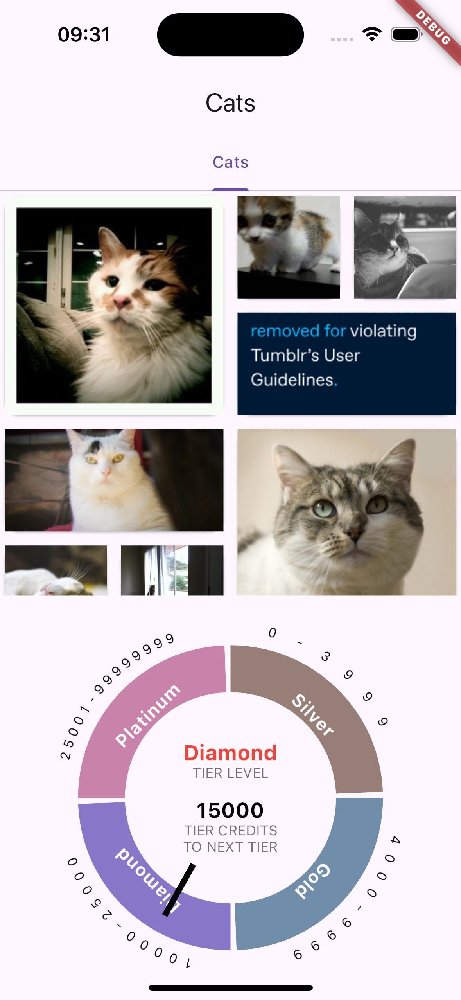

Here's the updated README file incorporating the provided project details and the screenshot:

---

# WietApp

Web app url: https://wietapp.vercel.app/

WietApp is an innovative mobile application developed using Flutter, providing a seamless experience for managing your cat's activities and tiers. This app is designed to help cat owners keep track of their pets' well-being and ensure they are always in their best condition.

## Table of Contents

- [Features](#features)
- [Installation](#installation)
- [Usage](#usage)
- [Project Overview](#project-overview)
- [Project Structure](#project-structure)
- [Contributing](#contributing)
- [License](#license)

## Features

- **Cat Management**: Easily manage and track your cats' activities.
- **Tier Indicators**: Visual indicators to monitor the health and activity tiers of your cats.
- **API Integration**: Fetch data from external APIs to enrich the app's functionality.
- **Responsive Design**: Optimized for both Android and iOS platforms.
- **Interactive UI**: User-friendly interface with smooth animations.

## Installation

To get started with WietApp, follow these steps:

1. **Clone the repository:**
   ```bash
   git clone https://github.com/yourusername/wietapp.git
   cd wietapp
   ```

2. **Install dependencies:**
   ```bash
   flutter pub get
   ```

3. **Run the app:**
   ```bash
   flutter run
   ```

## Usage

1. **Home Page**: View your cats and their current tiers.
2. **Add New Cat**: Use the form to add a new cat to the system.
3. **Tier Management**: Manage the tiers of each cat and update their activities.

## Project Overview

Welcome potential new Flutter Developer!!

### Directions

We will use Flutter to build a single tab app with a dynamic image grid of cats. Please follow the directions below.

### Steps to Follow

1. **Create a tab bar** with only 1 tab.
2. **Image Grid**: In this tab, your goal is to create an Image Grid with the list of cats from the Cats API endpoint.
   - Free (Cat) Image API: [https://portal.wietmobile.com:8443/api/test/data](https://portal.wietmobile.com:8443/api/test/data)
3. **Popup Window**: When clicking on any individual cat item, show a popup window and display the “id” of the selected image.
4. **Tier Indicator**: At the bottom of the screen, develop a circular tier indicator using the payload “tiers”.



## Project Structure

Here's a brief overview of the project's structure:

```
wietapp/
├── android/                # Android-specific files
├── ios/                    # iOS-specific files
├── lib/                    # Main Dart codebase
│   ├── application/        # Application logic
│   ├── data/               # Data models and repositories
│   ├── presentation/       # UI components and pages
│   └── main.dart           # Entry point of the app
├── web/                    # Web-specific files
├── windows/                # Windows-specific files
├── pubspec.yaml            # Project dependencies and metadata
├── README.md               # Project README file
└── ...                     # Other project files
```

## Contributing

We welcome contributions from the community! If you'd like to contribute, please follow these steps:

1. Fork the repository.
2. Create a new branch with a descriptive name.
3. Make your changes and commit them.
4. Push your changes to your forked repository.
5. Create a pull request detailing your changes.

## License

This project is licensed under the MIT License. See the [LICENSE](LICENSE) file for more details.

---

Feel free to enhance this README with additional information, such as screenshots, code snippets, or any other relevant details to better showcase your project on GitHub.
